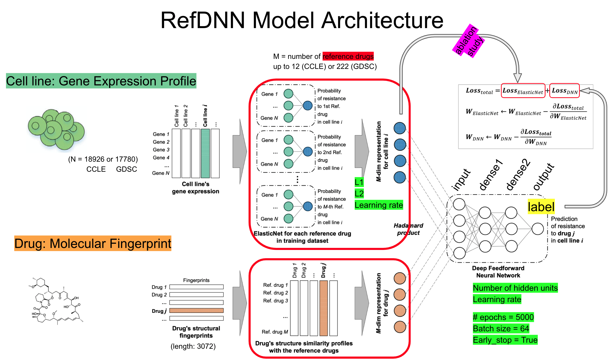
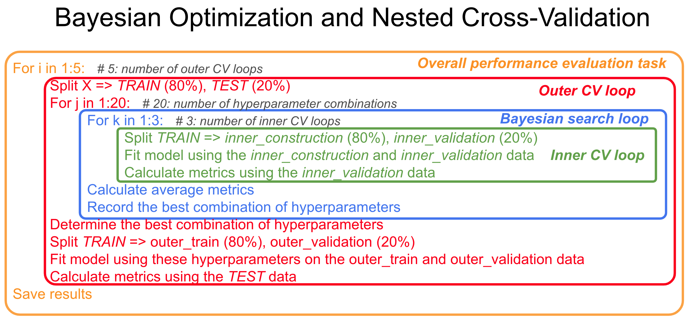
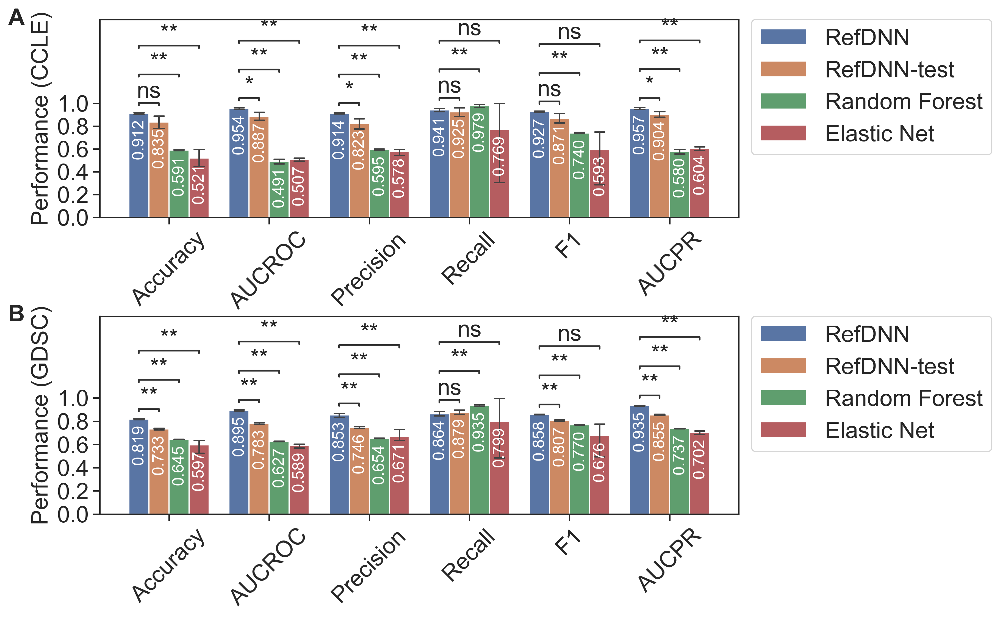
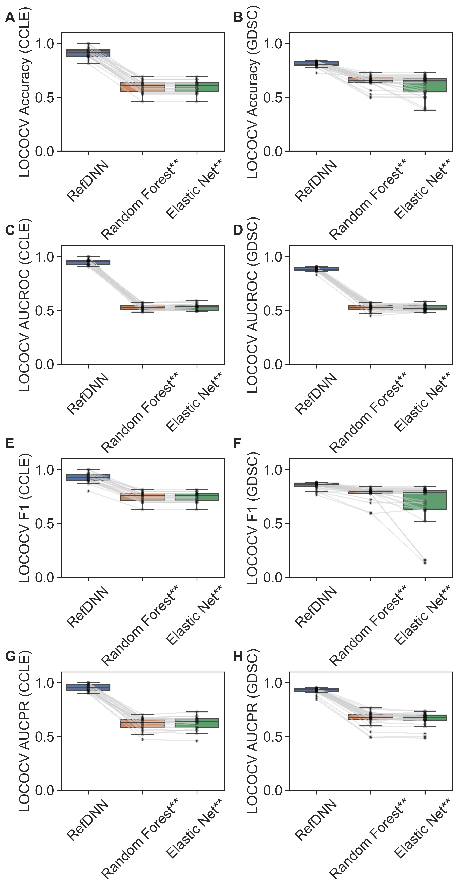
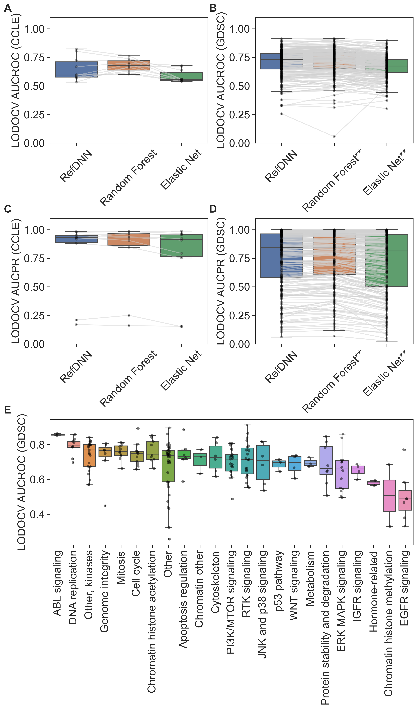
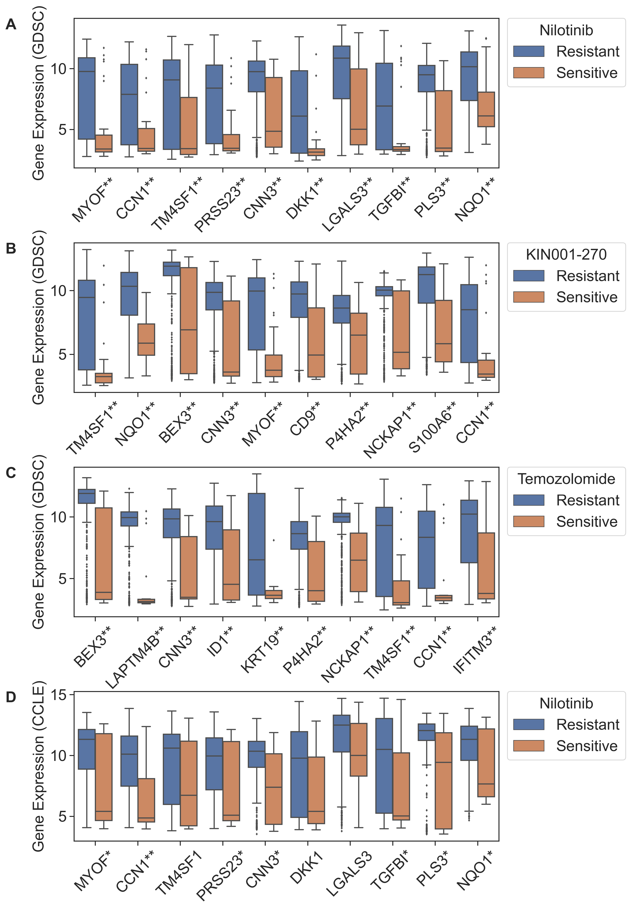

# Deep Learning for Healthcare
## RefDNN: a reference drug based neural network for more accurate prediction of anticancer drug resistance

## INTRODUCTION

This repo is a deep learning reproduction study based on the original publication and repo of the RefDNN model.  

The publication: *Choi, Jonghwan, et al. "RefDNN: a reference drug based neural network for more accurate prediction of anticancer drug resistance." Scientific Reports 10 (2020):1-11*.  

Link to the publication: https://www.nature.com/articles/s41598-020-58821-x  
Link to the repo: https://github.com/mathcom/RefDNN  


  
(Modified based on Figure 6 in the original paper)

The RefDNN project aims to predict cancer drug resistance and proposed a “reference drug” based neural network architecture. The task is to build a classifier to predict whether a cancer cell line is sensitive or resistant to a certain drug. The key idea of this work is to use a set of drugs (so-called “reference drug”) to learn the representations of cell lines based on gene expression and drugs by their molecular structure.


--------------------------------------------------------------------------------------------
## SYSTEM REQUIERMENTS

   - RefDNN requires system memory larger than 24GB.  
   - If you want to use tensorflow-gpu, GPU memory of more than 4GB is required.  

## DEPENDENCIES AND PYTHON ENVIRONMENT SETUP

This project is based on Python 3.6 and Tensorflow 1.12. We recommend install the virtual environment using conda. Here is an example of installing conda in the Linux system:

```
# install conda in Linux:
wget https://repo.anaconda.com/archive/Anaconda3-2020.02-Linux-x86_64.sh
sh Anaconda3-2020.02-Linux-x86_64.sh
# “enter” -> yes -> install at /home/chandan/anaconda3
source ~/.bashrc
```

You can setup the virtual environment using the following code:  

```
# for GPU machine:
conda env create -f environment_gpu.yml

# for cpu only:
conda env create -f environment.yml

# to use the virtual environment:
conda activate RefDNN

# test if gpu is available:
python
import tensorflow as tf
tf.test.is_gpu_available() # True
```


--------------------------------------------------------------------------------------------
## DATA

All data are provided by the original repo, and can also be found in this repo under the `data` directory. There are two pharmacogenomics datasets used in this study: the Cancer Cell Line Encyclopaedia (CCLE) and Genomics of Drug Sensitivity in Cancer (GDSC) datasets. Each dataset has three components:  


|                                           | GDSC                                              | CCLE                                         |
|-------------------------------------------|---------------------------------------------------|----------------------------------------------|
| Gene expression of cell lines (predictor) | 983 cell lines x 17780 genes                      | 491 cell lines x 18926 genes                 |
| Fingerprint of drugs (predictor)          | 222 drugs x 3072 dimensions                       | 12 drugs x 3072 dimensions                   |
| Drug response (response)                  | 190036 pairs (120606 resistance; 69430 sensitive) | 5724 pairs (3402 resistance; 2322 sensitive) |

--------------------------------------------------------------------------------------------
## EXPERIMENTS

Overall, there are 4 parts of experiments in this study:
1. Bayesian hyperparameter search and performance evaluation for different models.  
2. Leave-One-Cancer-type-Out Cross Validation (LOCOCV) to evaluate the performance on untrained cancer types.  
3. Leave-One-Drug-Out Cross Validation (LODOCV) to evaluate the performance on untrained drugs.  
4. Biomarker identification to extract weights for potential drug resistant associated genes from the RefDNN model used in part 1.  

--------------------------------------------------------------------------------------------
## SCRIPTS

### RefDNN model

The original RefDNN model, as well as the modified (for ablation study) version, can be found in the `refdnn` directory.  

### Basic scripts

The basic python scripts used for the 4 parts of experiments are kept in the `scripts` directory. These scripts can be called through command line interface by providing appropriate arguments.  
For example, to run the Bayesian hyperparameter search and performance evaluation for the RefDNN model, the script `1_nested_cv_RefDNN.py` can be used. Example usage:

```
python 1_nested_cv_RefDNN.py \
data/response_GDSC.csv \           # response data file
data/expression_GDSC.csv \         # cell line expression data
data/fingerprint_GDSC.csv \        # drug finger print data
-o output_1_GDSC \                 # output path
-v 2 \                             # verbose level
-b 64 \                            # batch size: default is 64
-t 5000 \                          # number of training steps: default is 5000
-s 20 \                            # number of Bayesian Search: default is 20
-k 5 \                             # number of outer loops: default is 5
-l 3                               # number of inner loops: default is 3
```

More detailed explanation of these arguments can be found in the original repo. Please note that using the default settings shown above, it takes over 20 hours to run the RefDNN model on the GDSC dataset, and 3 hours for the CCLE dataset, for a GPU machine with 16 GB of memory.  

### Model training

Here is an overview of Bayesian hyperparameter search and performance evaluation to help understand the procedures:

  

The `notebooks/RefDNN_example_1_Bayesian_Optimization_overview.ipynb` notebook is an interactive model training interface to run the nested cross validation on the CCLE dataset as an example. The script is based on the `1_nested_cv_RefDNN.py` script mentioned above. It also provides basic data exploration of the input data of the model.    

In addition, the `notebooks/RefDNN_example_2_one_training_step.ipynb` notebook provides some more in-depth details of the RefDNN model.  

### Experiments (including training and evaluation)

All of the command used to run all of the experiments, and the corresponding logs, can be found in the `notebook` directory:

- `running_log_1_bayesian.ipynb`   
- `running_log_2_LOCOCV.ipynb`   
- `running_log_3_LODOCV.ipynb`   
- `running_log_4_biomarkers.ipynb`   

The corresponding output files from these commands can be found in the `output_raw` directory (the files are renamed to be better organized).  

### Result analysis

All of the results were analyzed using Jupyter notebooks, including data wrangling and cleaning, statistical tests, and data visualization. These scripts are also kept in the `notebook` directory:

- `results_fig_1_performance_comparison.ipynb`  
- `results_fig_2_Leave_One_Cell_Out.ipynb`  
- `results_fig_3_Leave_One_Drug_Out.ipynb`  
- `results_fig_4_biomarkers.ipynb`  

All of the analysis output files are available in the `analysis_output` directory. For example, the comparison of performance metrics of different models using the GDSC dataset can be found in `analysis_output/1_Bayesian_GDSC_metrics.csv`:


|  Metrics  |    RefDNN     ||    RefDNN-test     ||    Random Forest     ||     Elastic Net    ||
|:---------:|:------:|:-----:|:-----------:|:-----:|:-------------:|:-----:|:-----------:|:-----:|
|           |  mean  |  std  |     mean    |  std  |      mean     |  std  |     mean    |  std  |
|  Accuracy |  0.819 | 0.006 |    0.733    | 0.008 |     0.645     | 0.002 |    0.597    | 0.079 |
|   AUCROC  |  0.895 | 0.006 |    0.783    | 0.010 |     0.627     | 0.002 |    0.589    | 0.021 |
| Precision |  0.853 | 0.023 |    0.746    | 0.009 |     0.654     | 0.003 |    0.671    | 0.064 |
|   Recall  |  0.864 | 0.024 |    0.879    | 0.024 |     0.935     | 0.009 |    0.799    | 0.342 |
|     F1    |  0.858 | 0.003 |    0.807    | 0.007 |     0.770     | 0.002 |    0.676    | 0.199 |
|   AUCPR   |  0.935 | 0.004 |    0.855    | 0.008 |     0.737     | 0.001 |    0.702    | 0.021 |


*Note: there are not preprocessing or pretrained model in this study.*

--------------------------------------------------------------------------------------------
## RESULTS

More detailed explanation of these results can be found in the final report.

Figure 1:  
   

Figure 2:  
   

Figure 3:  
   

Figure 4:  
   
--------------------------------------------------------------------------------------------
